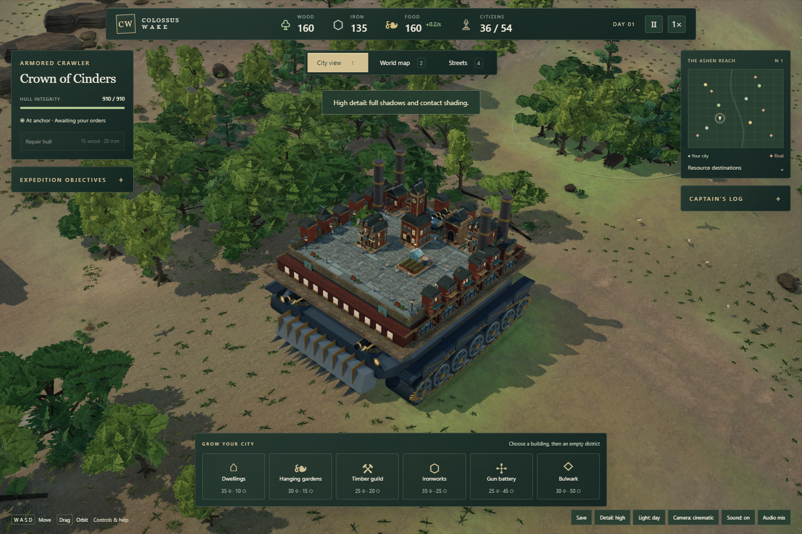

# Colossus Wake

**Build a city. Carry it into battle.**

A single-player 3D city-builder on a ruined future Earth. Raise a Gothic castle on a walking titan, command an industrial crawler, or sail a domed city above the valley. Gather resources, support your citizens, and defeat five rival cities in one playable region.



*Actual Alpha 1 desktop gameplay. [Screenshot provenance and cyborg view](docs/media/README.md).*

Colossus Wake is a working title. This private repository contains the **Alpha 1 PC prototype**, version `0.10.0-alpha.1`, and its development history.

[Playing & controls](docs/PLAYING.md) · [Development](docs/DEVELOPMENT.md) · [Roadmap](docs/ROADMAP.md) · [Changelog](CHANGELOG.md)

## Three factions, six carriers

| Faction | Carrier variants | City identity |
| --- | --- | --- |
| Thornbound | Flesh titan and cyborg titan | Gothic castle that grows one storey per district |
| Commonwealth | Armored crawler and elongated spiral-drill crawler | British industrial city on a horizontal deck |
| Saffron Courts | Horizontal-envelope airship and four-upright-balloon airship | Eastern-inspired domed city on a horizontal deck |

Build and upgrade districts, manage wood, iron, food and housing, then travel between finite resource deposits. Battle with aimed batteries, melee attacks and faction abilities. Weapon placement, firing arcs and castle clearance affect which shots can fire.

Both titan castles grow vertically on a fixed footprint. The cyborg's castle has half-height storeys; its robot and body weapons retain their scale. Construction order and district identities persist in saves.

## Play locally

On the owner's Windows PC, open **Colossus Wake - Kaiju Game** from the desktop. From this game folder, **Colossus Wake.exe** opens a local game window; **Play.cmd** is the fallback. See [Windows launcher details](DESKTOP_APP.md).

For a checkout with Node.js available:

```sh
node server.mjs
```

Open [127.0.0.1:4178](http://127.0.0.1:4178) in Chrome or Edge with WebGL2 and hardware acceleration. Runtime libraries and assets are bundled; local play needs no login or internet connection. See the [first-expedition guide](docs/PLAYING.md#first-expedition).

## Alpha 1 status

The September 17, 2026 verification record includes **127 passing unit tests**, 180 rendering combinations, 1,296 Gothic weapon-clearance cases, and desktop, touch-emulation and offline-package checks. These are recorded results for the documented Alpha 1 revision; ongoing automated checks cover a narrower scope. See [Alpha 1 verification](ALPHA1_VERIFICATION.md) and [Tests and package](https://github.com/reza477/kiju-game/actions/workflows/ci.yml).

The final independent environment review scored **7.5/10**. The **8.5 visual quality gate remains unmet** after four rounds; its final bounded review identified no concrete visual or runtime defect. [Read the critic's findings](art-reviews/alpha1-04.md).

Physical iPad/iPhone testing, Safari on Apple hardware, sustained mobile performance and long-session memory stability remain pending. Touch controls and an offline package exist, but there is **no hosted mobile game link**. See [mobile playtest status](MOBILE_PLAYTEST.md).

## Saves and privacy

Progress saves in the browser on your device, with manual export/import and recovery support. Keep an exported backup before clearing browser data or moving between devices. Saves do not synchronize automatically.

The local game has no analytics, advertising, accounts, cloud saves or external runtime services. GitHub holds the private source backup; it does not host a playable game. Repository maintenance and future game hosting are separate workflows. See [repository maintenance](docs/REPOSITORY_MAINTENANCE.md).

## Working on the project

```sh
npm ci
npm test
```

Start with the [development guide](docs/DEVELOPMENT.md), [contribution workflow](CONTRIBUTING.md), and [owner's design and review rules](AGENTS.md). The game uses plain JavaScript modules and bundled Three.js. This repository is independent of the Vancouver Curiosity Club website.

Models, procedural geometry and sound design are original project work. Bundled surface scans and HDR lighting come from Poly Haven under CC0; Three.js is MIT-licensed. See [asset credits](ASSET_CREDITS.md) and [the dependency license](vendor/LICENSE). Those third-party terms do not grant a license to the original game source or assets.
